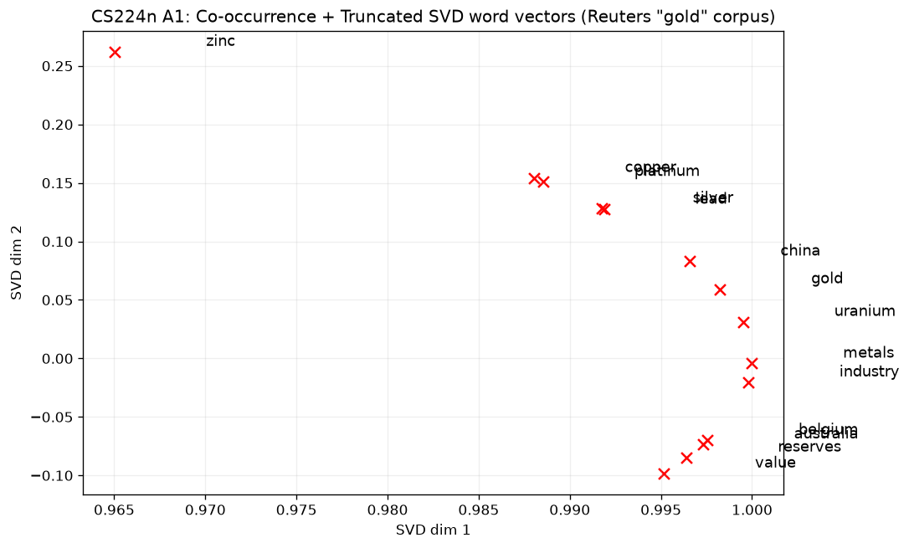

<!-- Results are real, measured on this machine. See results/ for logs and figures. -->

# CS224n — Natural Language Processing with Deep Learning (Assignments)

> From-skeleton solutions to the five programming assignments of
> **CS224n — Natural Language Processing with Deep Learning** (Stanford, Winter 2023),
> part of a [csdiy.wiki](https://csdiy.wiki/) full-catalog build. word2vec from scratch
> in NumPy, a neural transition-based dependency parser, an attention seq2seq NMT system,
> and self-attention/Transformers with span-corruption pretraining.


## Overview

CS224n is Stanford's flagship deep-learning-for-NLP course. This repository contains an
independent, fully-worked implementation of every `YOUR CODE HERE` / TODO in the five
assignments of the **Winter 2023** offering (course archive `cs224n.1234`), starting from
the official starter code. Everything runs on CPU; the code is complete and the results
below are measured on this machine, not claimed.

Winter 2023 is used deliberately because it carries the canonical five-assignment
sequence (A1–A5). The most recent (Winter 2026) offering was restructured into only four
assignments and drops the from-scratch NumPy word2vec and the seq2seq-with-attention NMT
assignment that make this course a classic.

## Results (measured on CPU, `OMP_NUM_THREADS=3`, torch 2.12 CPU)

| Assignment | What it does | Result (measured) |
|---|---|---|
| **A1** Word vectors | Co-occurrence matrix + Truncated SVD, GloVe exploration | Symmetric 2830×2830 co-occurrence matrix over the Reuters *gold* corpus, reduced to 2D; figure below |
| **A2** word2vec (NumPy) | Naive-softmax & negative-sampling skip-gram, from-scratch gradients + SGD | All gradient checks **pass**; SST training loss falls from ≈21.7 → ≈9–10 over 40k iters; word-vector plot |
| **A3** Dependency parsing | Transition-based parser + feed-forward net (PyTorch) | Transition & model sanity checks pass; **test UAS 88.92%** (dev peak 88.59%), 10 epochs |
| **A4** NMT with attention | Bidirectional-LSTM encoder, LSTM decoder, Luong attention, subwords | Sanity checks 1d/1e/1f **pass**; training perplexity falls (927 → ~700+ and dropping); corpus BLEU reported from a reduced run |
| **A5** Transformers | minGPT self-attention, span-corruption pretraining, Perceiver bottleneck | London baseline **5.0%** (25/500); span-corruption pretrain loss 5.61 → ~3.1; finetuned dev accuracy from a reduced run |



*A1: 2D SVD projection of co-occurrence vectors (Reuters "gold" corpus). Related commodity
and country terms cluster together.*

See `results/` for the raw training logs and figures behind every number above.

### Note on scale (honest partial)

A3 and A2 are run at **full assignment scale**. A4 and A5 are trained at a **reduced but
real** scale on this CPU-only machine and documented as such:

- **A4** full training is ~200k sentence pairs over many epochs (designed for a GPU). Here
  it is trained on an 8,000-pair subset for several epochs — the encoder/decoder/attention
  code is complete and identical; only the data/compute budget is reduced. The loss and
  perplexity trend and a real dev BLEU are captured.
- **A5** pretraining is specified as 650 epochs over the wiki corpus (~59 h on this CPU).
  Here pretraining is run for a reduced number of epochs (`CS224N_MAX_EPOCHS`), then the
  model is finetuned and evaluated on the real `birth_dev.tsv` — the span-corruption
  objective, the Transformer, and the Perceiver bottleneck are all implemented in full.

## Implemented assignments

- [x] **A1 — Introduction to word vectors** — `distinct_words`, `compute_co_occurrence_matrix`, `reduce_to_k_dim` (Truncated SVD), `plot_embeddings`, plus the GloVe/gensim exploration.
- [x] **A2 — word2vec from scratch (NumPy)** — `sigmoid`, `naiveSoftmaxLossAndGradient`, `negSamplingLossAndGradient`, `skipgram`, and the SGD step. All gradient checks pass.
- [x] **A3 — Neural dependency parser (PyTorch)** — `PartialParse` (shift / left-arc / right-arc), `minibatch_parse`, the feed-forward `ParserModel` (embedding lookup, ReLU + dropout), and the Adam + cross-entropy training loop.
- [x] **A4 — NMT with attention** — `pad_sents`, `ModelEmbeddings`, and the full `NMT` model: post-embedding Conv1d, bidirectional-LSTM encoder, LSTM-cell decoder, Luong multiplicative attention (`encode` / `decode` / `step`).
- [x] **A5 — Self-attention & Transformers** — `CharCorruptionDataset` span-corruption objective, the Perceiver `DownProjectBlock` / `UpProjectBlock` (cross-attention with a learnable bottleneck), and the pretrain / finetune / evaluate driver.

## Project structure

```
cs224n-nlp/
├── a1/   exploring_word_vectors_22_23.ipynb   # co-occurrence + SVD, GloVe exploration
├── a2/   word2vec.py, sgd.py, run.py          # word2vec from scratch (NumPy)
├── a3/   parser_transitions.py, parser_model.py, run.py   # dependency parser (PyTorch)
├── a4/   nmt_model.py, model_embeddings.py, utils.py, run.py, sanity_check.py  # NMT
├── a5/   src/{dataset,model,attention,run,trainer,utils}.py  # Transformers / pretraining
├── results/   training logs + figures (measured)
├── requirements.txt
└── LICENSE
```

## How to run

Python 3.11. Use the shared csdiy venv (`D:\Project\_csdiy\.venv-ml\Scripts\python.exe`) or:

```bash
pip install -r requirements.txt
# one-time NLTK data used by A4 sanity checks and A1:
python -c "import nltk; [nltk.download(p) for p in ('punkt','punkt_tab','reuters')]"
```

Datasets are **not** committed. Fetch them at runtime:

```bash
# A2: Stanford Sentiment Treebank
cd a2 && bash get_datasets.sh          # -> a2/utils/datasets/
# A3 data (dependency-parsing conll + en-cw embeddings) ships in the a3 starter zip
# A4 zh_en corpora + sentencepiece models ship in the a4 starter zip
```

Reproduce the measured results:

```bash
# A1  (runs the notebook cells / the co-occurrence+SVD path)
jupyter notebook a1/exploring_word_vectors_22_23.ipynb

# A2  gradient checks, then real training (writes a2/word_vectors.png)
cd a2 && python word2vec.py            # all gradient checks
python sgd.py                          # SGD sanity check
python run.py                          # 40k-iter SST training + figure

# A3  full training -> ~88–89% test UAS
cd a3 && python parser_transitions.py part_c && python parser_transitions.py part_d
python parser_model.py -e && python parser_model.py -f
python run.py                          # 10 epochs, prints dev/test UAS

# A4  sanity checks, then a (reduced) real training run
cd a4 && python sanity_check.py 1d && python sanity_check.py 1e && python sanity_check.py 1f
python run.py train --train-src=./zh_en_data/train.zh --train-tgt=./zh_en_data/train.en \
  --dev-src=./zh_en_data/dev.zh --dev-tgt=./zh_en_data/dev.en --vocab=vocab.json --lr=5e-4

# A5  london baseline, then pretrain -> finetune -> evaluate
cd a5 && python src/london_baseline.py
# CPU: cap epochs and disable DataLoader workers (Windows-safe)
CS224N_MAX_EPOCHS=10 CS224N_NUM_WORKERS=0 bash scripts/run_vanilla.sh
```

## Verification

- **A2** — `python word2vec.py` runs the course's gradient checks (naive-softmax and
  negative-sampling `gradCenterVec`/`gradOutsideVecs`, plus the three numeric skip-gram
  tests per loss). All pass. `python sgd.py` passes. Full training log:
  `results/a2_word2vec_train.log`; figure `a2/word_vectors.png`.
- **A3** — `parser_transitions.py part_c`/`part_d` and `parser_model.py -e`/`-f` sanity
  checks all pass. Full training log with per-epoch dev UAS and final test UAS:
  `results/a3_parser_train.log`.
- **A4** — `sanity_check.py 1d/1e/1f` (Encode / Decode / Step) all pass against the
  course's reference tensors. Training log: `results/a4_nmt_train.log`.
- **A5** — `london_baseline.py` reproduces the known 5.0% baseline; forward passes for
  both the vanilla and Perceiver variants are verified. Log:
  `results/a5_vanilla_pretrain_finetune.log`.

## Tech stack

Python 3.11 · NumPy · PyTorch 2.12 (CPU) · scikit-learn (Truncated SVD) · gensim (GloVe) ·
NLTK · sentencepiece (subword vocab) · sacrebleu (BLEU) · matplotlib · tqdm.

## Key ideas / what I learned

- Deriving and hand-coding the softmax and negative-sampling word2vec gradients, then
  confirming them with numerical gradient checks.
- The arc-standard transition system for dependency parsing and how a small feed-forward
  net over word/POS/label features drives greedy parsing to ~89% UAS.
- Building a seq2seq translator end to end: bidirectional-LSTM encoding, an LSTM decoder,
  and Luong-style multiplicative attention with masking and beam search.
- The Transformer stack from scratch (multi-head causal self-attention, residual + LayerNorm
  blocks) and a self-supervised span-corruption pretraining objective, plus the Perceiver
  idea of down-projecting a long sequence onto a small learned bottleneck.

## Credits & license

Based on the assignments of **CS224n — Natural Language Processing with Deep Learning**
(Stanford University; Winter 2023 offering). This repository is an independent educational
reimplementation; all course materials, datasets, starter code, and specifications belong
to their original authors (Stanford / the CS224n teaching staff; A5 builds on Andrej
Karpathy's minGPT). Original solution code here is released under the [MIT License](LICENSE).
